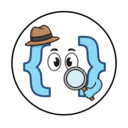

# DOM Detective - Google Chrome Extension

<div align="center">
  
  
  ### Inspector profesional de elementos HTML para desarrolladores y testers
  
  
  
  
</div>


## Descripción
**DOM Detective** es una extensión profesional para Google Chrome diseñada para desarrolladores web, testers QA y automatizadores. Permite inspeccionar elementos HTML, generar selectores de forma inteligente y monitorear solicitudes de red (Fetch & XHR) con una interfaz moderna y eficiente (inspirada en la paleta de colores de VERCEL y el funcionamiento de Postman).


### Características
1. **Generación inteligente de selectores**: XPath (relativo y absoluto), CSS Selector, ID, Name y Class
2. **Selector visual interactivo**: Resalta elementos al pasar el mouse con color personalizable
3. **Monitor de red**: Captura y analiza todas las solicitudes Fetch y XHR en tiempo real
4. **Experimentador de recursos**: Prueba y modifica solicitudes HTTP directamente desde la extensión
5. **Menú contextual integrado**: Acceso rápido con clic derecho

---


## Instalación
### Instalación manual (modo desarrollador)

1. Descarga o clona este repositorio:
```bash
git clone https://github.com/rodolfocasan/dom-detective.git
```

2. Abre Google Chrome y navega a:
```
chrome://extensions/
```

3. Activa el **Modo de desarrollador**

4. Haz clic en **Cargar extensión sin empaquetar**

5. Selecciona la carpeta del proyecto descargado

6. ¡Listo! Verás el ícono de DOM Detective en tu barra de extensiones (se recomienda fijar)

---


## Guía de uso
### 1. Generación de selectores con menú contextual
La forma más rápida de obtener selectores:

1. Haz **clic derecho** sobre cualquier elemento de la página
2. Selecciona **DOM Detective** en el menú contextual
3. Elige el tipo de selector que necesitas:
   - XPath Relativo
   - XPath Absoluto
   - CSS Selector
   - ID
   - Name
   - Class

El selector se copiará automáticamente al portapapeles.


### 2. Selector Visual
Para una experiencia más interactiva:

1. Haz clic en el ícono de la extensión
2. Selecciona **"Selector visual"**
3. Mueve el cursor sobre los elementos para resaltarlos
4. Haz clic en el elemento deseado para ver todos los selectores disponibles
5. Selecciona el tipo de selector que prefieres

**Características adicionales:**
- Cambia el color de resaltado en el panel de control (para no entorpecer con los colores de UI de la página actual)
- Cierra el selector visual con el botón X o presionando ESC


### 3. Monitor Fetch & XHR

Captura y analiza todas las solicitudes de red:

1. Haz clic en el ícono de la extensión
2. Selecciona **"Fetch & XHR"**
3. Presiona **"Iniciar análisis"**
4. La página se recargará automáticamente
5. Todas las solicitudes se capturarán en tiempo real

**Información disponible:**
- Método HTTP (GET, POST, PUT, DELETE, etc.)
- URL completa
- Headers de solicitud y respuesta
- Payload / Request Body
- Response completo (JSON formateado)
- Cookies asociadas
- Tiempo de respuesta
- Estado HTTP


### 4. Experimentador de recursos (adentro de Monitor Fetch & XHR)
Prueba y modifica solicitudes capturadas:

1. En el panel de Fetch & XHR, haz clic en una solicitud para expandir sus detalles
2. Presiona el botón **"Experimentar recurso"**
3. Modifica los siguientes parámetros:
   - Método HTTP
   - URL
   - Headers (formato JSON)
   - Body (formato JSON o texto)
4. Haz clic en **"Enviar solicitud"**
5. Observa la respuesta en tiempo real con:
   - Código de estado
   - Tiempo de respuesta
   - Body formateado
   - Headers de respuesta

---


## Casos de uso
### Para desarrolladores web
- Debugging rápido de elementos DOM
- Generación de selectores para manipulación con JavaScript
- Análisis de APIs y endpoints durante el desarrollo
- Pruebas de solicitudes HTTP sin usar herramientas externas

### Para QA Testers
- Creación de locators para automatización (Selenium, Playwright, Cypress)
- Validación de APIs y respuestas
- Identificación precisa de elementos en páginas complejas
- Documentación de selectores para casos de prueba

### Para automatizadores
- Generación rápida de XPath y CSS Selectors únicos
- Análisis de tráfico de red para reverse engineering
- Pruebas de APIs antes de implementar en scripts
- Identificación de elementos dinámicos

---


## Configuración

La extensión utiliza `chrome.storage.local` para persistir configuraciones como:
- Color de resaltado del selector visual
- Estado del monitoreo de red
- Solicitudes capturadas (se mantienen durante la sesión)

---


## Permisos requeridos
La extensión solicita los siguientes permisos:

- **contextMenus**: Para el menú de clic derecho
- **activeTab**: Para interactuar con la pestaña actual
- **storage**: Para guardar preferencias del usuario
- **debugger**: Para monitoreo avanzado de red
- **host_permissions (`<all_urls>`)**: Para funcionar en cualquier página web

---


## Problemas conocidos y soluciones
### El monitor de red no captura solicitudes
**Solución**: Asegúrate de hacer clic en "Iniciar análisis" y permitir que la página se recargue.

### Los selectores no se copian
**Solución**: Verifica que el portapapeles tenga permisos en Chrome (chrome://settings/content/clipboard).

### El debugger se desconecta
**Solución**: Esto puede ocurrir si abres las DevTools de Chrome. Simplemente reinicia el análisis.

---


## Contribuciones

Las contribuciones son bienvenidas. Si deseas mejorar DOM Detective:

1. Haz fork del repositorio
2. Crea una rama para tu feature (`git checkout -b feature/AmazingFeature`)
3. Commit tus cambios (`git commit -m 'Add some AmazingFeature'`)
4. Push a la rama (`git push origin feature/AmazingFeature`)
5. Abre un Pull Request


## Autor
**Rodolfo Casan**

- GitHub: [@rodolfocasan](https://github.com/rodolfocasan)
- YouTube: [@rodolfocasan](https://www.youtube.com/@rodolfocasan)

---


## Agradecimientos
Si DOM Detective te ha sido útil, considera darle una estrella al repositorio. ¡Tu apoyo motiva el desarrollo continuo!

---

<div align="center">
  Desarrollado con ❤️ para la comunidad de desarrolladores y testers
</div>